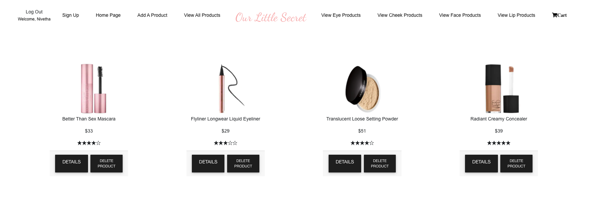
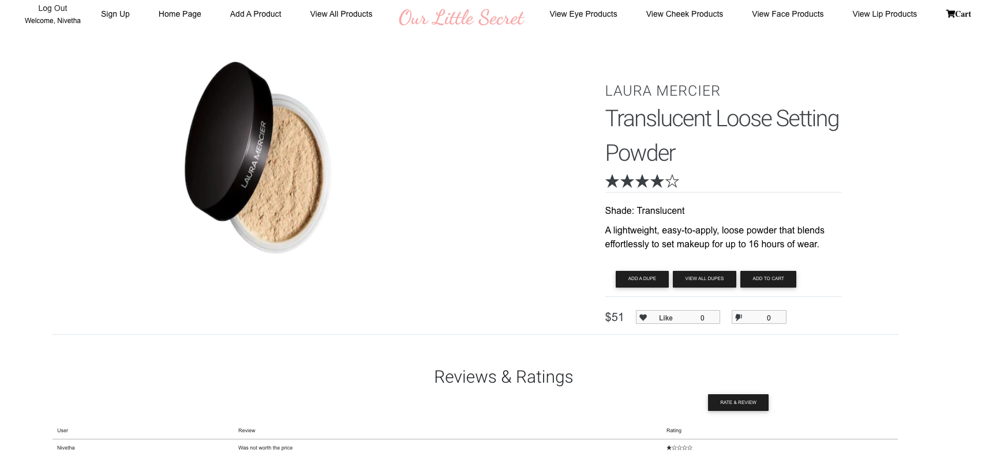
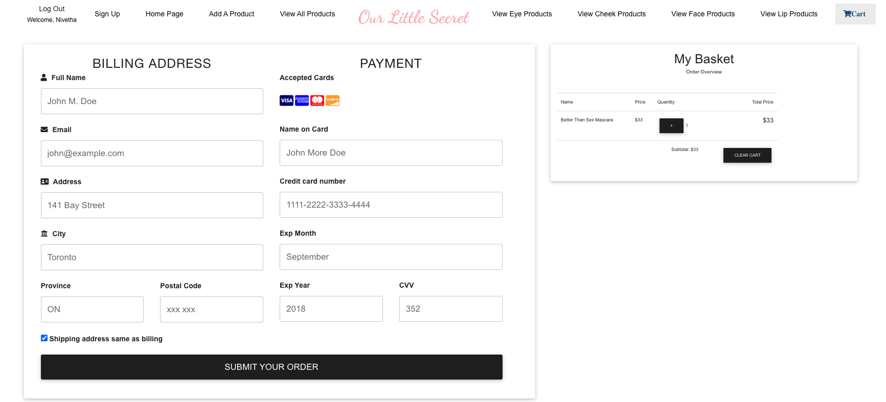

# Our Little Secret - Project 4 MERN Stack Project

## App Title

Our Little Secret is a full-stack CRUD app that allows users to shop for makeup products while finding dupes for products. There are a very few websites that showcase this information to users. This app was created to allow users to shop for products, while saving money on cheaper dupes. Here's to hoping Our Little Secret App will save money for users!

## Screenshot(s)

## Technologies Used

* MongoDB/Mongoose
* Express
* React
* Node
* CSS 
* MDBootstrap

## Getting Started

* Deployed Heroku App Link: https://mern-makeup-store.herokuapp.com/
* Trello Board Link: https://trello.com/b/VbLJuPO2/makeup-community-to-makeup-store-mern-project
* ERD Link: https://lucid.app/lucidchart/b1fed8db-c434-4b2c-a95b-525c7a85086b/edit

## Next Steps

Some next steps would be is to add more features to this store such as a search bar and a user profile page. I would also like to get image uploading available using Multer or AWS. In addition, I would like to implement a item decrement feature in my shopping cart.
